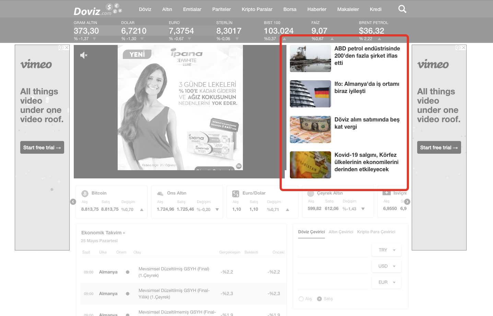
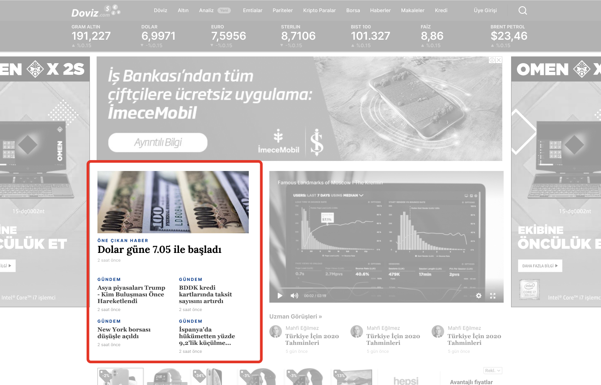
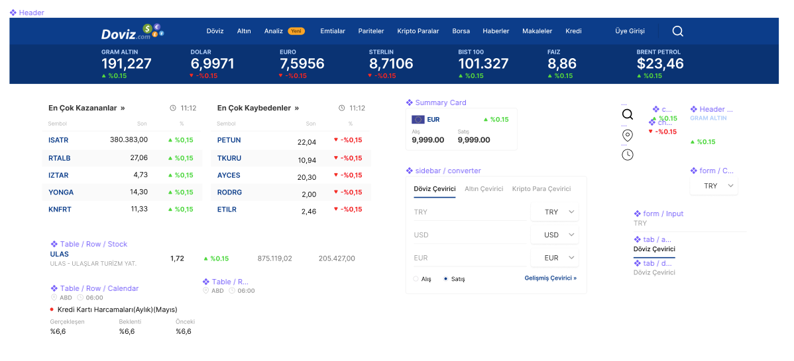
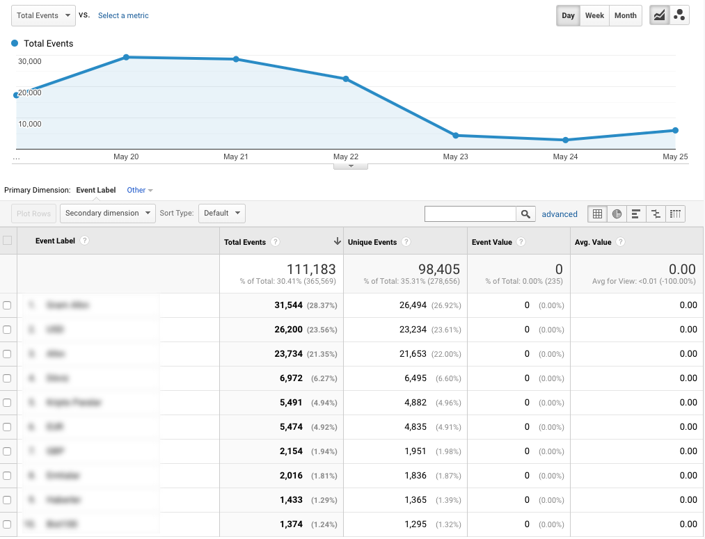
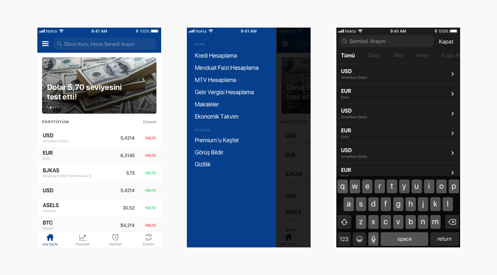
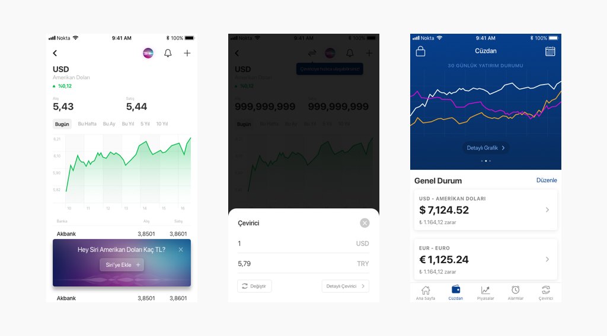
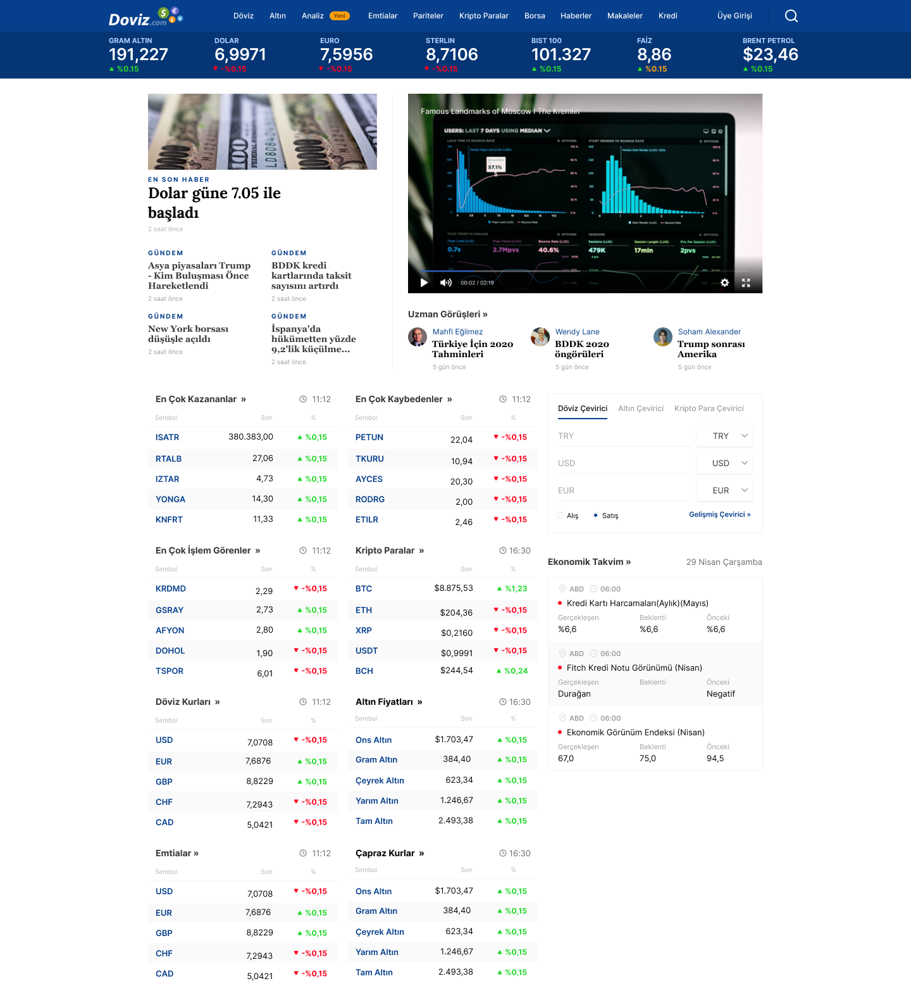

Doviz is a mobile & web platform that allows people to manage their portfolio and watch international market data. People use Doviz when they need to check the latest market data.

  

    <h1>
      ~10M
    </h1>
    <h5>Monthly Active User</h5>
  

  

    <h1>
      #65
    </h1>
    <h5>on AppStore Finance</h5>
  

  

    <h1>
      #59
    </h1>
    <h5>on SimilarWeb Finance</h5>
  

## Roles & Responsibilities
Nokta has in-house product team consist of multidisciplinary Product Managers, Web and Mobile Developers and Designers. I worked as both Designer and Front-End Developer of Doviz product.

## Challenges
### :dart: Creating data-oriented products for our users. 
Try to keep it as clear, simple and user friendly as possible. 

### :loop: Consistency on different platforms
Doviz runs on 4 different product lines: Desktop, Mobile and both iOS and Android. It brings the challenge itself: To have a design system on all products.

### :moneybag: We run ADs!
Doviz's business modal is based on ad revenue. Our biggest challenge is implement advertising on pages and **not to kill UX**.

## Actions
### :iphone: A/B Tests
Using Google Optimize, we tested some variants of design choices to compare their impacts on Avg. Session Duration on mobile browsers.

### :computer: Optimizing layouts 
Changing featured news orientation to increase readability among ads on desktop pages.

  

    
    
Old Hard to find where the news are. Users reading orientation starts from left to right.

  

  

    
    
New Better spacing, better hierarchy and more suitable to reading orientation.

  

  

### :blue_book: Design System
Shared design library among all the layouts to keep consistency

  

    
    
Components Screen I use both Figma and Sketch Components to keep consistency among all the pages I design

  

  

### :chart_with_upwards_trend: Analyzing data from Google Analytics and Firebase.

  

    
    
Events from Google Analytics As a product team, we check the data before make a decision, and compare the results with previous data after making a decision.

  

  

## Featured Screens

  

    
    
Doviz iOS Home, Drawer and Search Screens

  

  

    
    
Doviz iOS Currency Detail, Converter Popup and Wallet Screens

  

  

    
    
Doviz Desktop Homepage

  

  

---

**Client:** [Nokta Medya](http://noktamedya.com)

**&copy 2020**

Thanks for reading. If you have any question, drop me on [Twitter](https://twitter.com/kantarci)

