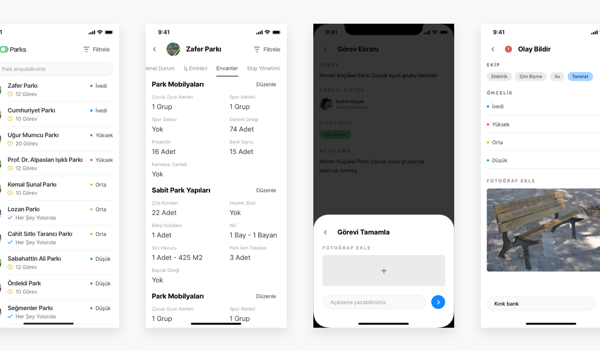

It is a cloud-based facility management software that helps to improve resource utilization to reduce operational expenses and prioritize services.

## Story of Parks
When we founded Seyisco, we would like to be a key player in the smart city revolution. Therefore, we developed digital products that can help municipalities to grow with the technology.

While we were connecting more and more municipalities, we saw that there are a huge gap between field workers and back-office. We listened them, heard how lack of communication cost plenty of time and money. 

We came up with a solution that can fill the gap: Parks.

## Roles & Responsibilities
Seyisco is a startup where I co-founded in 2017. We have a multidisciplinary founding team of engineers. I worked on Parks as Designer and Front-End Developer. I also attended customer meetings and user feedback sessions.

## Challenges

### Try to distrupt current products but not to experience
Our idea is to distrupt and connect three products they use regularly: Excel, Whatsapp and Paperwork. We were very cautios while understanding the problem space. Something which sounds so simple, but is often missed. We couldn't jump to a solution, without understanding what they're trying to solve first.

### Different user types
As a team, we were trying to solve different problems of different user types. Their behaviours, environments, etc., is varying and we needed to address problems for better decision making for desired outcomes. I used Airtable to define user types and scenarios.

 

## Actions

### Ran 5+ User Sessions
Since the beginning of the idea, we kept our first customer close. We listened their problems, and present the ideas about how we solve the issue. We gathered all the feedbacks but also but a small barrier to [escape the build trap](https://vimeo.com/224453335). 

### Try to look familiar
In order to combine all the experiences they have on current products, we try to design familiar experiences and interfaces. Parks mobile apps looks like a messaging app, however it is beyond a messaging app. It is enhanced with the task management features.  

## Featured Screens

  

    
Parks Field App Home, Park Detail, Modal and Problem Screens

    
  

  

    
Parks Desktop Home Screen

    
  

 

---

**Client:** [Seyisco](https://seyis.co)

**&copy 2020**

Thanks for reading. If you have any question, drop me on [Twitter](https://twitter.com/kantarci)

