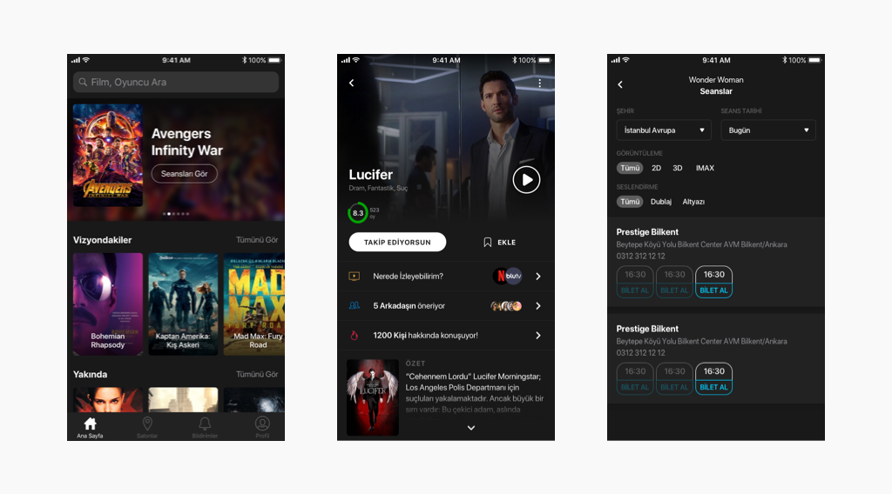
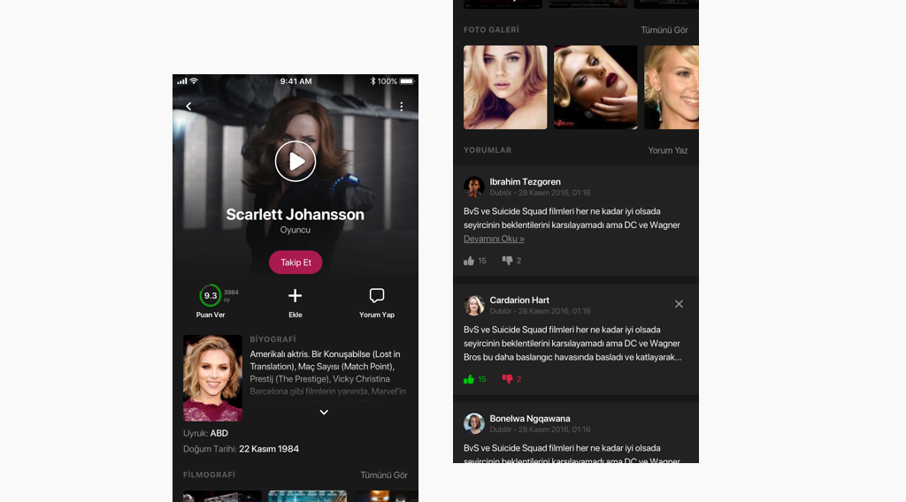
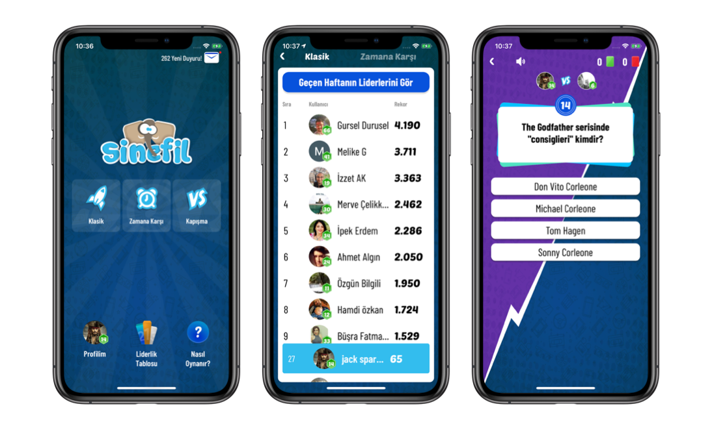
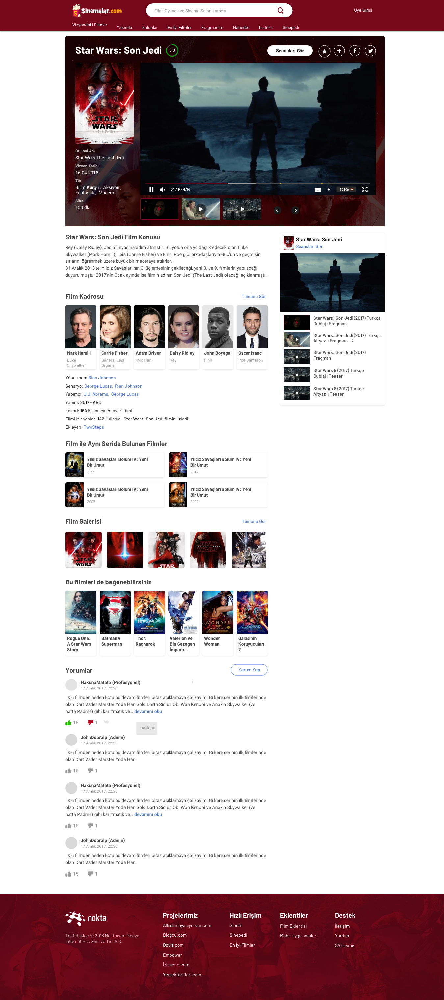

Sinemalar is a mobile & web platform that allows people to explore movies and TV series. People use Sinemalar when they need to check information about movies & TV Series, trailers and showtimes.

  

    <h1>
      2M+
    </h1>
    <h5>Monthly Active User</h5>
  

  

    
    <h5 class="mt-8">Entertainment Category</h5>
  

## Roles & Responsibilities
Nokta has in-house product team consist of multidisciplinary Product Managers, Web and Mobile Developers and Designers. I worked as both Designer and Front-End Developer of Sinemalar *(means Movies in English)* products.

## Challenges
### :flashlight: Clear and comprehensible content and navigation structure
Among all the options, just like choosing a movie on a theatre or a decide a TV series based on your friend's suggestion, Sinemalar need to be as intuitive as possible.

### :movie_camera: Understand movie & TV exploration behavior of users 
We need to know how people decide if a movie is worth the watch or not. Some by checking the movie’s rate and maybe the reviews some of them just watch by their recency. 

### :performing_arts: Not to be just a movie database, also entertain 
Sinemalar is an entertainment product, to achieve measurable success, we need to engage and retain users. One of the best ways to achieve this is to build an in-app community. 

## Actions
### :mag: Creating User Flows
We have created userflows for both creating an intuitive interface and evaluating existing interfaces. In addition, in order to be aligned on the team, user flows helped us to understand how product will be working.

### :+1: User Testings
Most views happen the month leading up to a film’s release, but there’s also a lot of interest in a movie after it’s in theaters. We saw that people decide based on trailer, director, showtimes, reviews of people who watched. 

### :ferris_wheel: Games and Community
We developed a game, Sinefil, which users can test their movie knowledge. Sinefil helped us to improve users life time value. Being able to compete with each other within an app, users became more motivated and engaged. 

In addition, we built a feed where users can add friends and see their activity on the app. In-app community helped us to collect data about our users’ behavior within the app and use this information to improve the product.

## Featured Screens

  

    
Sinemalar iOS Home, Movie Detail and Showtimes

    
  

  

    
Sinemalar iOS Artist Detail Screen

    
  

  

    
Sinefil iOS Home, Challange your Friends, Trivia Screens

    
  

  

    
Sinemalar Desktop Movie Detail Screen

    
  

 

---

**Client:** [Nokta Medya](http://noktamedya.com)

**&copy 2020**

Thanks for reading. If you have any question, drop me on [Twitter](https://twitter.com/kantarci)

